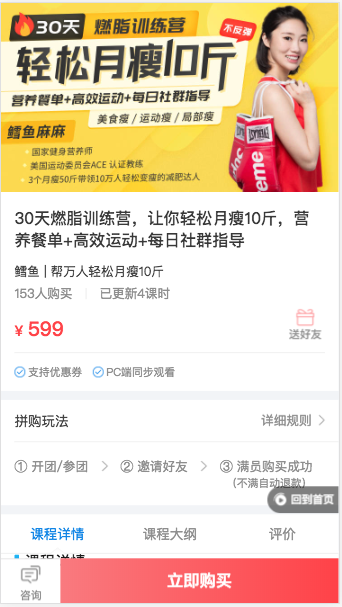
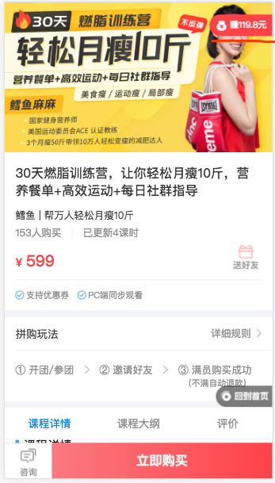
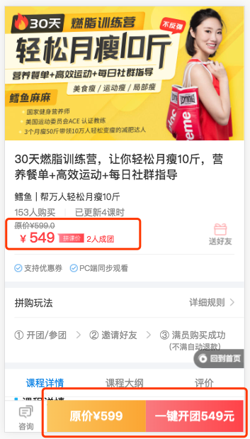
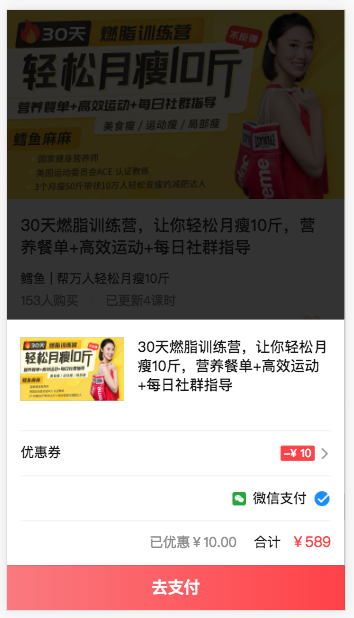

## 关于唯库分销、渠道的链接使用规则

从唯库后台、个人分销产生的分销链接，el, [`https://www.yojiang.cn/l/s/299-610354`](https://www.yojiang.cn/l/s/299-610354)，默认都是不显示***分销按钮***、***会员销售***、***拼团***

如下图所示：

作为内部渠道链接，可通过参数控制显示各自模块

## 分销按钮 show_commission=1
往链接后面加上链接`show_commission=1`，el, [`https://www.yojiang.cn/l/s/299-610354?show_commission=1`](https://www.yojiang.cn/l/s/299-610354?show_commission=1)，会显示出来***分销按钮***

如下图所示：

## 会员销售、拼团 show_buy_vip=1
往链接后面加上链接`show_buy_vip=1`，el, [`https://www.yojiang.cn/l/s/299-610354?show_buy_vip=1`](https://www.yojiang.cn/l/s/299-610354?show_commission=1)，会显示出来***会员销售***、***拼团***，（注，课程需要设置有会员价或拼团价的前提下）

如下图所示：

## show_buy=1
个别需求需要打开链接，往链接后面加上链接`show_buy=1`，el, [`https://www.yojiang.cn/l/s/299-610354?show_buy=1`]，马上显示支付弹窗

如下图所示：

## 参数组合、链接拼接的方法
各个参数可以按照运营需求自由组合，
el,

[`https://www.yojiang.cn/l/s/299-610354?show_commission=1&show_buy_vip=1`](https://www.yojiang.cn/l/s/299-610354?show_commission=1&show_buy_vip=1),

[`https://www.yojiang.cn/l/s/299-610354?show_buy=1&show_buy_vip=1`](https://www.yojiang.cn/l/s/299-610354?show_buy=1&show_buy_vip=1),

[`https://www.yojiang.cn/l/s/299-610354?show_commission=1&show_buy_vip=1`](https://www.yojiang.cn/l/s/299-610354?show_commission=1&show_buy_vip=1),
......

链接拼接的规则：
https://www.yojiang.cn/l/s/299-610354 ，原始链接后面紧接着"?"第一个参数名称"param"=参数值"value"&第二个参数名称"param1"=第二个参数值"value1"依次类推，有多少个参数写上多少个参数及参数值。需要注意的是除开第一个参数前面需要用"?"表示是参数开始之外其它参数用"&"相连。

注意两个符号`?`,`&`，没有参数的情况，添加第一个参数需要用`?`号拼接。之后多个参数之间使用`&`拼接。

如果有不懂可联系“叶子”

